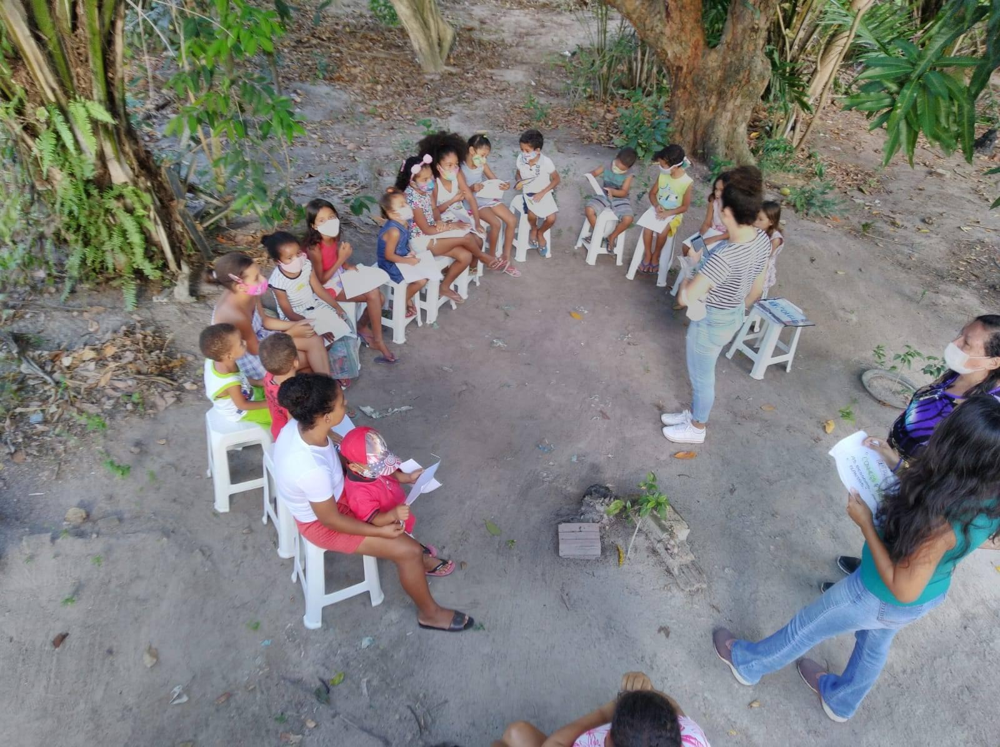

# Empréstimo de livros
Aplicação web em desenvolvimento para atender uma biblioteca itinerante em uma comunidade indígena

## Features
 **CSS** - Foi utizado para dar estilo às páginas

 **HTML5** - Foi utizado para fazer as marcações das páginas

 **PHP** - Foi utizado para o backend da aplicação e se conectar ao banco de dados

 **Javascript** - Foi utizado para gerar interação com usuário, bem como tornar a experiência da aplicação como APP por meio de PWA

 **Mysql** - Foi utizado para o gereciamento do banco de dados

